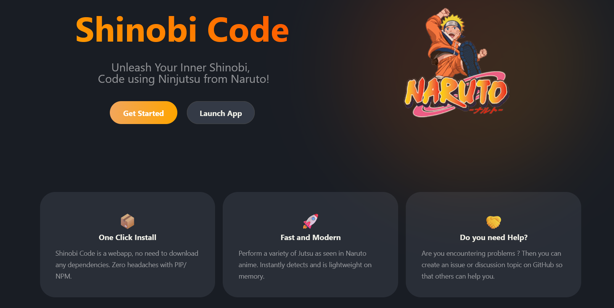

# Shinobi Code

Shinobi Code is a VSCode Extension, which helps you to code using Ninjutsu from your fav. anime Naruto.

## Features

1. Capable of recognizing 13 hand signs from Naruto.
2. Speech-to-text in both English and Japanese.
3. Executes custom commands within VSCode such as git commands, shortcuts and many more, based on the detected  jutsu.

## Documentation

[Shinobi Code Website](https://shinobicode.dev)

## Repositories

[**Docs Site**](https://github.com/shinobi-c0de/shinobi-code) - This repo, documentation site for Shinobi Code project. Written using RSPress

[**Web App**](https://github.com/shinobi-c0de/shinobi-code-web) - Shinobi Code Web App, written in Typescript

[**API**](https://github.com/shinobi-c0de/shinobi-code-api) - Shinobi Code API, written in Rust

[**VSCode Extension**](https://github.com/shinobi-c0de/shinobi-code-extension) - Shinobi Code extension, written in Typescript

[**Hand Sign Detection**](https://github.com/shinobi-c0de/hand-sign-detection) - Hand Sign Detection model exported as WASM using Rust

## Screenshots

