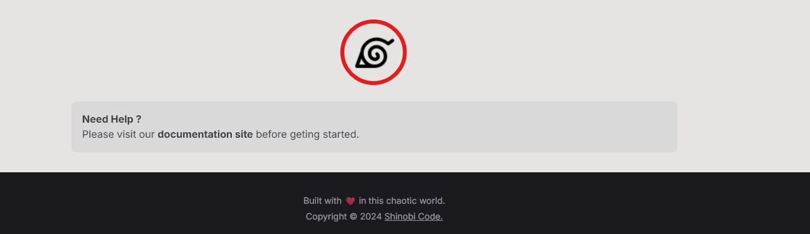

import AppButton from "../../../components/AppButton.astro";
import VSButton from "../../../components/VSButton.astro";

Shinobi Code is a VSCode Extension but that doesn't mean we are going to leave the non-devs in the dark.  
For non-devs, please click below button.

<AppButton/>

For devs, click below button and install the extension.

<VSButton/>

:::note
VSCode Extension is still in development and it can be unstable.
:::

## Follow below steps, after visting the site

1. Click on the record button (Konoha Logo) to capture your speech and Handsigns.

2. First, shout out any jutsu name loud and clear. (Please refer [Speech Text](/getting-started/speech) page)
3. After speech text is identified correctly, perform the required hand signs as mentioned in [Jutsu](/getting-started/jutsu) page.
4. If handsigns are performed correctly, jutsu should be detected. (Jutsu is diplayed at the footer of video)

:::note
For the handsigns to be detected correctly, please make sure to be in a **well lit environment** and perform all the handsign below neck-level as the model was trained in these conditions.
:::

:::caution
Shinobi Code needs access to webcam video and mic audio.   
Please see [Disclaimer](/others/disclaimer) page to understand how we process your video and audio. Dont' worry, we don't.
:::
